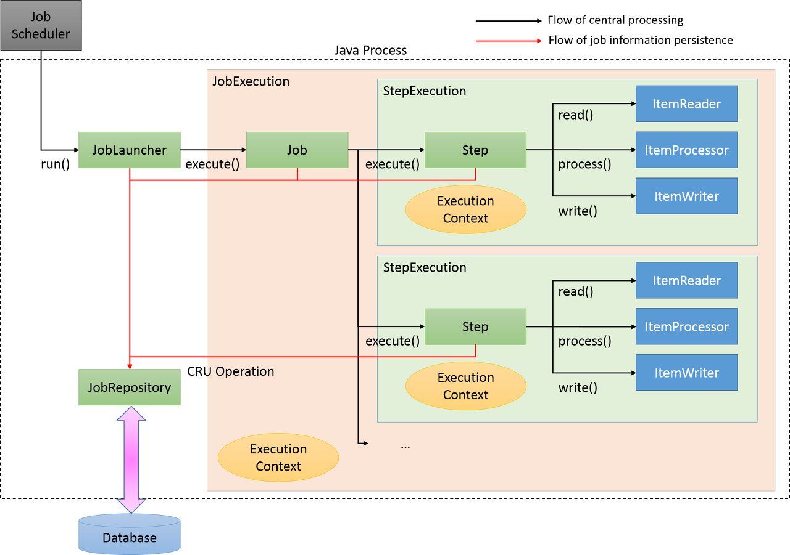
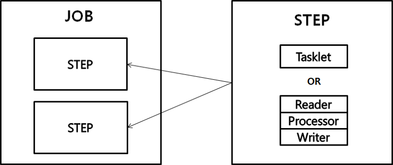
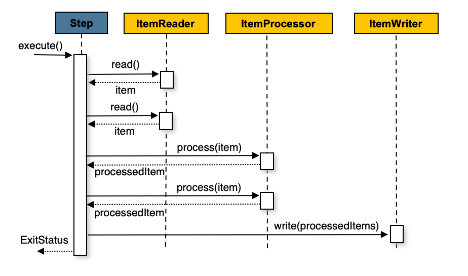
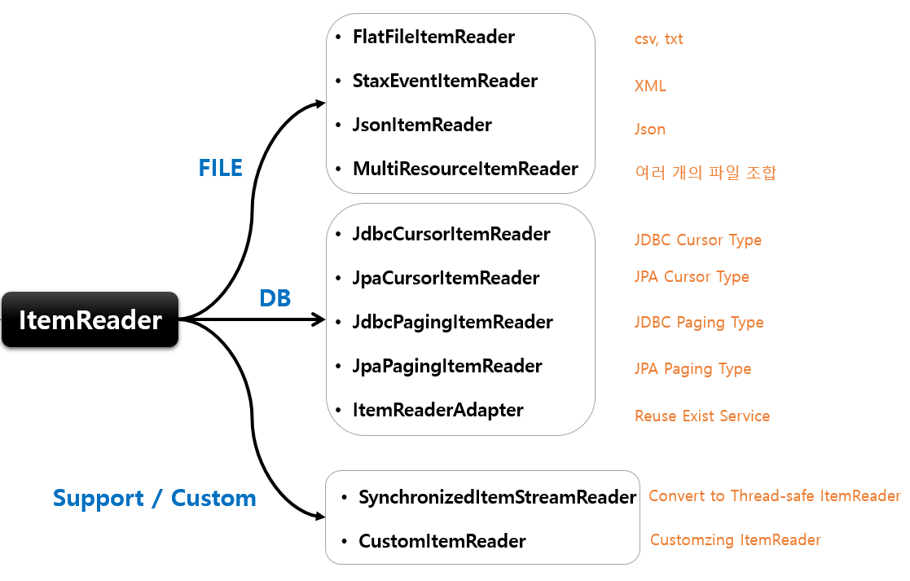
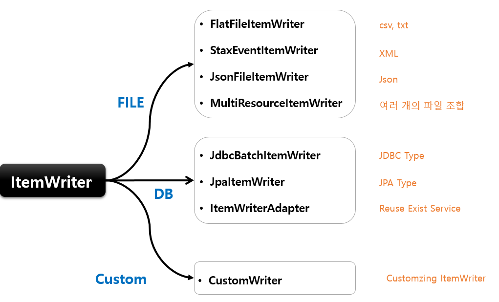
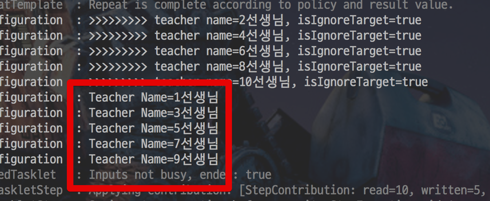
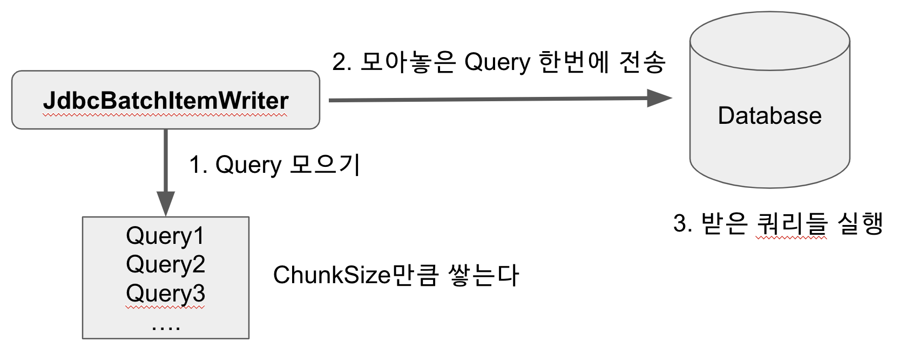

# Spring Batch

##### <버전>
* java : 17
* spring boot : 3.4.2
* spring-batch-core : 5.2.1

### Spring batch
* 배치 프로세싱 == **일괄처리**
* 대량의 데이터를 처리하고 관리하기 위한 엔터프라이즈급 애플리케이션을 구축하기 위한 경량 배치 프레임워크
* **읽고 → 가공하고 → 저장하는 프로세스를 실행**하는 방식인 Spring 기반의 배치 처리 프레임워크
* 제공하는 기능
    * **로깅/추적**
    * **트랜잭션 관리**
    * **작업 처리 통계**
    * **작업 재시작, 건너뛰기**
    * **리소스 관리 등 대용량 레코드 처리에 필수적인 기능**
* 배치가 실패하여 작업을 재시작 시 처음부터가 아닌 실패한 지점부터 실행을 한다.
* 중복 실행을 막기 위해 성공한 이력이 있는 Batch는 동일한 Parameter로 실행 시 Excpetino이 발생한다.

#### "일괄 처리"의 사용 예시
* 대용량의 비지니스 데이터를 복잡한 작업으로 처리해야하는 경우
* 특정한 시점에 스케줄러를 통해 자동화된 작업이 필요한 경우
* 대용량 데이터의 포맷을 변경, 유효성 검사 등의 작업을 트랜잭션 안에서 처리 후 기록해야하는 경우

#### Spring Batch vs Quartz? 또는 Scheduler?
> Spring Batch는 Scheduler가 아니기에 비교 대상이 아니다.
* Spring Batch는 Batch Job을 관리하지만 Job을 구동하거나 실행시키는 기능은 지원하고 있지 않다. 
* Spring에서 Batch Job을 실행시키기 위해서는 Quartz, Scheduler, Jenkins등 전용 Scheduler를 사용하여야 한다.

#### Spring Batch 원칙 및 가이드
* **배치와 서비스에 영향**을 최소화할 수 있도록 구조와 환경에 맞게 디자인하기
* 배치 어플리케이션 내에서 가능한한 복잡한 로직은 피하고 단순하게 설계하기
* 데이터 처리하는 곳과 데이터의 저장소는 물리적으로 가능한한 가까운 곳에 위치하게 하기
* I/O 등의 시스템 리소스의 사용을 최소화하고 **최대한 많은 데이터를 메모리 위에서 처리**하기
* 처리 시간이 많이 걸리는 작업을 시작하기 전에 메모리 재할당에 소모되는 시간을 피하기 위해 충분한 메모리를 할당하기
* 데이터 무결성을 위해서 적절한 **검사 및 기록**하는 코드를 추가하기

<br/><br/>

### Spring Batch Job 구성 및 개념

##### Job
* 배치처리 과정을 하나의 단위로 만들어 놓은 객체
* 배치처리 과정에 있어 전체 계층 최상단에 위치함.
* 여러개의 Job이 진행될 수 있음

##### JobInstance
* Job의 실행 단위
* Job을 실행 시 = 1개의 JobInstance가 생성
    * ex) 1월 1일 실행, 1월 2일 실행 시 각각의 JobInstance가 생성되며 1월 1일 실행한 JobInstance가 실패하여 다시 실행을 시키더라도 이 JobInstance는 1월 1일에 대한 데이터만 처리하게 된다.

##### JobParameters
* JonInstance의 구별법 : JobParameters 객체로 구분
    * JobParameters : JobInstance 구별 외에도 JobInstacne에 전달되는 매개변수 역할도 하고 있다.
    * JobParameters의 형식 : String, Double, Long, Date

##### JobExecution
* JobInstance에 대한 실행 시도에 대한 객체
    * ex) 1월 1일에 실행한 JobInstacne가 실패하여 재실행을 하여도 동일한 JobInstance를 실행시키지만, 기존에 실행 시킨 것과 재실행 시킨 것에 대한 JobExecution은 개별로 생긴다.
* JobExecution은 JobInstance 실행에 대한 상태,시작시간, 종료시간, 생성시간 등의 정보를 갖고 있다.

##### Step
* Job의 배치처리를 정의하고 순차적인 단계를 캡슐화한 것
* Job은 최소한 1개 이상의 Step을 가져야 하며 Job의 실제 일괄 처리를 제어하는 모든 정보가 들어있다.

##### StepExecution
* Step 실행 시도에 대한 객체
* 하지만 Job이 여러개의 Step으로 구성되어 있을 경우 이전 단계의 Step이 실패하게 되면 다음 단계가 실행되지 않음으로 실패 이후 StepExecution은 생성되지 않는다.
* JobExecution과 동일하게 실제 시작이 될 때만 생성된다.
* JobExecution에 저장되는 정보 외에 read 수, write 수, commit 수, skip 수 등의 정보들도 저장된다.

##### ExecutionContext
* Job에서 데이터를 공유 할 수 있는 데이터 저장소
* Spring Batch에서 제공하는 ExecutionContext : JobExecutionContext, StepExecutionContext (차이 : 저장되는 타이밍이 다름)
    * JobExecutionContext : Commit 시점에 저장
    * StepExecutionContext : 실행 사이에 저장
* ExecutionContext를 통해 Step간 Data 공유가 가능하며 Job 실패시 ExecutionContext를 통한 마지막 실행 값을 재구성할 수 있다.

##### JobRepository
* 모든 배치 처리 정보를 담고있는 매커니즘
* Job이 실행 -> JobRepository에 JobExecution과 StepExecution을 생성 -> JobRepository에서 Execution 정보들을 저장하고 조회하며 사용

##### JobLauncher
* Job과 JobParameters를 사용하여 Job을 실행하는 객체

##### ItemReader
* Step에서 Item을 읽어오는 인터페이스
* ItemReader에 대한 다양한 인터페이스가 존재하여 다양한 방법으로 Item을 읽어올 수 있다.

##### ItemWriter
* 처리 된 Data를 Writer 할 때 사용
* 처리 결과물에 따라 Insert가 될 수도 Update가 될 수도 Queue를 사용한다면 Send가 될 수도 있다.
* Read와 동일하게 다양한 인터페이스가 존재한다.
* Writer는 기본적으로 Item을 Chunk로 묶어 처리하고 있다.

##### ItemProcessor
* Reader에서 읽어온 Item을 데이터를 처리하는 역할
* Processor는 배치를 처리하는데 필수 요소는 아니며 Reader, Writer, Processor 처리를 분리하여 각각의 역할을 명확하게 구분한다.


### Spring Batch 사용하기

* Job : 1개 이상의 Step들의 모음이며, 순차적인 Step을 수행하며 Batch를 수행한다.
* Step 방식 : Tasklet 처리 방식, Chunk 지향 처리 방식

##### Tasklet 기반 처리 (Tasklet-Oriented Processing)
* chunk 기반의 ItemReader & ItemWriter & ItemProcessor의 묶음도 Tasklet이지만 이 부분에서는 ```implements Tasklet```하는 형식에 대해 설명한다.
* 한 번에 하나의 작업을 실행하는 방식
* 단순한 작업(예: 로그 출력, 파일 이동, DB 초기화 등)에 적합함.
* 개발자가 직접 Tasklet을 구현해야 함.
  
* 적용예제
    0. 의존성 추가 : ```implementation 'org.springframework.boot:spring-boot-starter-batch'```
    1. Tasklet 생성
        ```java
        @Component
        public class SimpleTasklet implements Tasklet {
        
            @Override
            public RepeatStatus execute(StepContribution contribution, ChunkContext chunkContext) throws Exception {
                System.out.println("Tasklet 방식으로 Step 실행!");
                return RepeatStatus.FINISHED; // 한 번 실행 후 종료
            }
        }
        ```
        * ```RepeatStatus.FINISHED``` 반환 : 한 번만 실행하고 종료
        * ```RepeatStatus.CONTINUABLE``` 반환 : 하면 계속 실행
    2. Tasklet를 Step에 등록 
        ```java
        @Configuration
        @RequiredArgsConstructor
        public class SimpleBatchConfig extends DefaultBatchConfiguration{
        
            private final SimpleTasklet simpleTasklet;
        
        
            @Bean
            public Job simpleJob(JobRepository jobRepository, PlatformTransactionManager transactionManager) {
                return new JobBuilder("simpleScheduleJob", jobRepository)
                        .start(simpleStep(jobRepository, transactionManager))
                        .build();
            }
        
        
            @Bean
            public Step simpleStep(JobRepository jobRepository, PlatformTransactionManager transactionManager){
                return new StepBuilder("simpleStep", jobRepository)
                        .tasklet(simpleTasklet, transactionManager) // .chunk(chunkSize, transactionManager)
                        .build();
            }
        }
        ```
    3. @Scheduler를 통한 실행
        ```java
        @Log4j2
        @Component
        @RequiredArgsConstructor
        public class ScheduledTask {
        
            private final JobLauncher jobLauncher;
        
            private final Job simpleScheduleJob;
        
            @Scheduled(cron = "*/30 * * * * ?")
            public void runSimpleJob(){
               log.info("===========================");
               log.info("simple Schedule Job 시작");
               log.info("===========================");
        
                JobParameters jobParameters = new JobParametersBuilder()
                        .addLong("time", System.currentTimeMillis()) // 중복 실행 방지
                        .toJobParameters();
                try{
                    jobLauncher.run(simpleScheduleJob, jobParameters);
                } catch (Exception e) {
                    log.error("simpleScheduleJob 배치를 실패하였습니다. : ", e);
                }
        
            }
        
        }

        ```
    4. 결과
        ```
        2025-02-17T09:09:14.626+09:00  INFO 21888 --- [spring-batch] [           main] c.e.springbatch.SpringBatchApplication   : Started SpringBatchApplication in 4.174 seconds (process running for 4.675)
        2025-02-17T09:09:30.014+09:00  INFO 21888 --- [spring-batch] [   scheduling-1] c.e.springbatch.schedule.ScheduledTask   : ===========================
        2025-02-17T09:09:30.016+09:00  INFO 21888 --- [spring-batch] [   scheduling-1] c.e.springbatch.schedule.ScheduledTask   : simple Schedule Job 시작
        2025-02-17T09:09:30.016+09:00  INFO 21888 --- [spring-batch] [   scheduling-1] c.e.springbatch.schedule.ScheduledTask   : ===========================
        2025-02-17T09:09:30.105+09:00  INFO 21888 --- [spring-batch] [   scheduling-1] o.s.b.c.l.s.TaskExecutorJobLauncher      : Job: [SimpleJob: [name=simpleScheduleJob]] launched with the following parameters: [{'time':'{value=1739750970016, type=class java.lang.Long, identifying=true}'}]
        2025-02-17T09:09:30.145+09:00  INFO 21888 --- [spring-batch] [   scheduling-1] o.s.batch.core.job.SimpleStepHandler     : Executing step: [simpleScheduleStep]
        10
        9
        8
        7
        6
        5
        4
        3
        2
        1
        2025-02-17T09:09:40.270+09:00  INFO 21888 --- [spring-batch] [   scheduling-1] o.s.batch.core.step.AbstractStep         : Step: [simpleScheduleStep] executed in 10s123ms
        2025-02-17T09:09:40.313+09:00  INFO 21888 --- [spring-batch] [   scheduling-1] o.s.b.c.l.s.TaskExecutorJobLauncher      : Job: [SimpleJob: [name=simpleScheduleJob]] completed with the following parameters: [{'time':'{value=1739750970016, type=class java.lang.Long, identifying=true}'}] and the following status: [COMPLETED] in 10s187ms
        2025-02-17T09:10:00.006+09:00  INFO 21888 --- [spring-batch] [   scheduling-1] c.e.springbatch.schedule.ScheduledTask   : ===========================
        2025-02-17T09:10:00.006+09:00  INFO 21888 --- [spring-batch] [   scheduling-1] c.e.springbatch.schedule.ScheduledTask   : simple Schedule Job 시작
        2025-02-17T09:10:00.006+09:00  INFO 21888 --- [spring-batch] [   scheduling-1] c.e.springbatch.schedule.ScheduledTask   : ===========================
        2025-02-17T09:10:00.039+09:00  INFO 21888 --- [spring-batch] [   scheduling-1] o.s.b.c.l.s.TaskExecutorJobLauncher      : Job: [SimpleJob: [name=simpleScheduleJob]] launched with the following parameters: [{'time':'{value=1739751000006, type=class java.lang.Long, identifying=true}'}]
        2025-02-17T09:10:00.071+09:00  INFO 21888 --- [spring-batch] [   scheduling-1] o.s.batch.core.job.SimpleStepHandler     : Executing step: [simpleScheduleStep]
        10
        9
        8
        7
        6
        5
        4
        3
        2
        1
        2025-02-17T09:10:10.231+09:00  INFO 21888 --- [spring-batch] [   scheduling-1] o.s.batch.core.step.AbstractStep         : Step: [simpleScheduleStep] executed in 10s160ms
        2025-02-17T09:10:10.283+09:00  INFO 21888 --- [spring-batch] [   scheduling-1] o.s.b.c.l.s.TaskExecutorJobLauncher      : Job: [SimpleJob: [name=simpleScheduleJob]] completed with the following parameters: [{'time':'{value=1739751000006, type=class java.lang.Long, identifying=true}'}] and the following status: [COMPLETED] in 10s228ms
        ```

##### Chunk 기반 처리 (Chunk-oriented Processing) - 보편적인 배치 조합

* 대량 데이터를 작은 덩어리(Chunk)로 나누어 처리하는 방식
* 한번에 하나씩 아이템을 입력 받아 Chunk 단위의 덩어리로 만든 후 Chunk 단위로 트랜잭션을 처리함 , 즉 Chunk 단위의 Commit 과 Rollback이 이루어짐
* 즉, 한 트랜잭션 : 한 개의 chunk의 읽기 + 가공 + 쓰기
* 데이터를 한 번에 메모리에 적재하지 않고, 트랜잭션 단위로 처리하여 메모리 절약 및 성능 최적화를 제공한다.
    * Reader와 Processor에서는 1건씩 다뤄지고, Writer에선 Chunk 단위로 처리
    
* Chunk 기반 처리 흐름
    0. ```ChunkOrientedTasklet``` : Chunk 지향 처리의 전체 로직을 다루는 것
    1. ```ItemReader``` : DB, API 등에서 데이터 읽기
        
        * ItemStream 인터페이스 : **주기적으로 상태를 저장하고 오류가 발생하면 해당 상태에서 복원**하기 위한 마커 인터페이스
        * => 즉, 배치 프로세스의 실행 컨텍스트와 연계해서 **ItemReader의 상태를 저장하고 실패한 곳에서 다시 실행할 수 있게 해주는 역할**
    2. ```ItemProcessor``` : 데이터 가공, 변환, 필터링
    3. ```ItemWriter``` : 처리된 데이터를 DB 등에 저장
        
    4. Chunk 단위로 트랜잭션 처리
        * ex) chunkSize = 10이면 10개씩 처리 후 commit
    
<br/>  

> * **&lt;ItemReader&gt;**
* 수백만개의 데이터를 조회하는 쿼리가 있을 경우 해당 데이터를 모두 한 번에 메모리에 불러와 처리하지 않아야 함.
    * but, spring의 jdbcTemplate은 분할 처리를 지원하지 않아(쿼리 결과를 그대로 반환해서) 개발자가 직접 limit, offset을 사용해야 함. 
    * => 이런 문제점을 해결하기 위해 Spring batch가 2개의 Reader 타입을 지원함.
* 방법 1. <u>**cursor**</u> : Jdbc ResultSet의 기본 기능으로, ResultSet이 open 될 때마다 next()가 호출되어 DB의 데이터가 반환됨.
    * => 이를 통해 필요에 따라 DB데이터를 Streaming 할 수 있다. 
    * => Cursor 방식은 Database와 커넥션을 맺은 후, Cursor를 한칸씩 옮기면서 지속적으로 데이터를 빨아옵니다.
    * => Cursor 기반 ItemReader 구현체
        * JdbcCursorItemReader
        * HibernateCursorItemReader
        * StoredProcedureItemReader
    * => CursorItemReader의 주의 사항
        * CursorItemReader를 사용할 때는 Database와 SocketTimeout을 충분히 큰 값으로 설정해야 한다 
        * => Cursor는 하나의 Connection으로 Batch가 끝날때까지 사용되기 때문에 
        * => Batch 수행 시간이 오래 걸리는 경우에는 PagingItemReader를 사용하는 것이 좋다 
        * => Paging의 경우 한 페이지를 읽을때마다 Connection을 맺고 끊기 때문에 아무리 많은 데이터라도 타임아웃과 부하 없이 수행될 수 있다
* 방법 2. <u>**paging**</u> : 페이지라는 Chunk로 Database에서 데이터를 검색하는 것으로, 즉, 페이지 단위로 한번에 데이터를 조회해오는 방식이다.
    * => Paging 방식에서는 한번에 10개 (혹은 개발자가 지정한 PageSize)만큼 데이터를 가져옵니다.
    * => Multi Thread로 Batch를 구현해야하는 상황이라면 PagingItemReader를 사용해야한다. Cursor는 대량의 데이터가 아니고, 멀티쓰레드 환경이 아닌 곳에서 사용하는게 좋다
    * => Spring Batch에서는 offset과 limit을 PageSize에 맞게 자동으로 생성해 준다. 각 페이지마다 새로운 쿼리를 실행하므로 페이징시 결과를 정렬하는 것이 중요해서 데이터 결과의 순서가 보장될 수 있도록 order by가 권장된다.
    * => Paging 기반 ItemReader 구현체
        * JdbcPagingItemReader
        * HibernatePagingItemReader
        * JpaPagingItemReader
    * => PagingItemReader 주의 사항
        * 정렬 (Order)가 무조건 포함되어 있어야 한다.

> **&lt;ItemProcessor&gt;**
* 적용 예제
    ```java
    // id가 짝수일 경우 return null;을 함으로써 Writer에 넘기지 않도록 함. 
    @Bean
    public ItemProcessor<Teacher, Teacher> processor() {
    return teacher -> {
    
            boolean isIgnoreTarget = teacher.getId() % 2 == 0L;
            if(isIgnoreTarget){
                log.info(">>>>>>>>> Teacher nsame={}, isIgnoreTarget={}", teacher.getName(), isIgnoreTarget);
                return null;
            }
    
            return teacher;
        };
    }
    ```
    * 결과 
        
        * 출처 : https://jojoldu.tistory.com/347?category=902551

> **&lt;ItemWriter&gt;**
* Chunk 단위로 묶인 item List를 다룸
* Database의 영속성과 관련해서는 항상 마지막에 Flush를 해줘야만 한다. (JpaItemWriter - ```entityManager.flush()```, HibernateItemWriter - ```session.clear()```)
* DB와 관련된 Writer
    * JdbcBatchItemWriter : JDBC의 Batch 기능을 사용하여 **한번에 Database로 전달하여 Database 내부에서 쿼리들이 실행**
        
        * 이렇게 처리하는 이유 : 어플리케이션과 데이터베이스 간에 데이터를 주고 받는 회수를 최소화 하여 성능 향상을 하기 위해
        * 적용 예제
            ```java
            /**
              * reader에서 넘어온 데이터를 하나씩 출력하는 writer
            */
            @Bean // beanMapped()을 사용할때는 필수
            public JdbcBatchItemWriter<Pay> jdbcBatchItemWriter() { // JdbcBatchItemWriter의 제네릭 타입 = Reader/Processor에서 넘겨주는 값의 타입
                return new JdbcBatchItemWriterBuilder<Pay>()
                    .dataSource(dataSource)
                    .sql("insert into pay2(amount, tx_name, tx_date_time) values (:amount, :txName, :txDateTime)")
                    .beanMapped()
                    .build();
            }
            
            new JdbcBatchItemWriterBuilder<Map<String, Object>>() // Map 사용
                .columnMapped()
                .dataSource(this.dataSource)
                .sql("insert into pay2(amount, tx_name, tx_date_time) values (:amount, :txName, :txDateTime)")
                .build();
            ```
    * JpaItemWriter
        * JPA 영속성 컨텍스트(EntityManager)를 통해 데이터를 저장
        * 적용 예제
            ```java
            @Slf4j
            @RequiredArgsConstructor
            @Configuration
            public class JpaItemWriterJobConfiguration {
                private final JobBuilderFactory jobBuilderFactory;
                private final StepBuilderFactory stepBuilderFactory;
                private final EntityManagerFactory entityManagerFactory;  // JpaItemWriter는 JPA를 사용하기 때문에 영속성 관리를 위해 EntityManager를 할당해줘야함. : 일반적으로 spring-boot-starter-data-jpa를 의존성에 등록하면 Entity Manager가 Bean으로 자동생성되어 DI 코드만 추가해주면 됨.
                
                private static final int chunkSize = 10;
            
                @Bean
                public Job jpaItemWriterJob() {
                    return jobBuilderFactory.get("jpaItemWriterJob")
                            .start(jpaItemWriterStep())
                            .build();
                }
            
                @Bean
                public Step jpaItemWriterStep() {
                    return stepBuilderFactory.get("jpaItemWriterStep")
                            .<Pay, Pay2>chunk(chunkSize)
                            .reader(jpaItemWriterReader())
                            .processor(jpaItemProcessor())
                            .writer(jpaItemWriter())
                            .build();
                }
            
                @Bean
                public JpaPagingItemReader<Pay> jpaItemWriterReader() {
                    return new JpaPagingItemReaderBuilder<Pay>()
                            .name("jpaItemWriterReader")
                            .entityManagerFactory(entityManagerFactory)
                            .pageSize(chunkSize)
                            .queryString("SELECT p FROM Pay p")
                            .build();
                }
            
                @Bean
                public ItemProcessor<Pay, Pay2> jpaItemProcessor() {
                    return pay -> new Pay2(pay.getAmount(), pay.getTxName(), pay.getTxDateTime());
                }
            
                /**
                * * EntityManager를 사용하여 JPA의 영속성 컨텍스트를 통해 데이터를 저장
                * => 내부적으로 EntityManager.merge(item) 실행함.  기존 엔티티는 update, 새로운 엔티티는 insert 처리
                */
                @Bean
                public JpaItemWriter<Pay2> jpaItemWriter() { // Writer에 전달하는 데이터가 Entity 클래스라면 JpaItemWriter를 사용
                    JpaItemWriter<Pay2> jpaItemWriter = new JpaItemWriter<>();
                    jpaItemWriter.setEntityManagerFactory(entityManagerFactory);
                    return jpaItemWriter;
                }
            }
          
            ```
    * HibernateItemWriter


<br/>  

* 여러 부가작업
    ```java
    @Bean
    public Step simpleChunkStep(JobRepository jobRepository, PlatformTransactionManager transactionManager){
        return new StepBuilder("simpleChunkStep", jobRepository)
                .<String, String>chunk(10, transactionManager) // <입력형태, 출력형태>chunk(size, transactionManager) : 한 번에 10개의 데이터를 읽고 처리한 후 트랜잭션을 커밋
                .reader(itemReader())
                .writer(itemWriter())
                .startLimit(1) // 재실행 가능 횟수 : Step의 실행 횟수를 제한(성공/실패 여부와 관계 x)
                .allowStartIfComplete(true) // 재실행에 포함시키기
                .faultTolerant()
                .skipLimit(10) // 데이터를 처리하는 동안 설정된 Exception 이 발생한 경우, 해당 데이터 처리를 건너뛰는 기능
                .skip(Exception.class) // skip할 Exception, skip된 item만 롤백
                .noSkip(FileNotFoundException.class) // skip 되지 않는 특정 예외 설정
                .retryLimit(3) // 재시도 가능 횟수 : Step이 실패했을 때 재시도할 최대 횟수
                .retry(RuntimeException.class) // 다시 시도할 수 있는 예외, 재시도 후에도 실패하면 트랜잭션 전체가 롤백됨(해당 chunk가 모두 실패)
                .noRollback(ValidationException.class) // 해당 예외가 발생해도 롤백을 진행하지 않음
                .build();
    }
    ```

<br/>  

* 적용예제
    0. 의존성 추가 : ```implementation 'org.springframework.boot:spring-boot-starter-batch'```
    1. ItemReader 생성
        ```java
        @Log4j2
        @Configuration
        @RequiredArgsConstructor
        public class SimpleBatchConfig extends DefaultBatchConfiguration {
            private final EntityManagerFactory entityManagerFactory;

            @Bean
            public JpaPagingItemReader<Data> itemReader(){ 
                return new JpaPagingItemReaderBuilder<Data>()
                    .name("data 테이블 JpaPagingItemReader")
                    .entityManagerFactory(entityManagerFactory)
                    .pageSize(10) // pageSize == chunkSize
                    .queryString("SELECT d FROM Data d WHERE createdAt >= '2025-02-18' ORDER BY id DESC")
                    .build();
            }
        }
        ```
    2. ItemProcessor 생성
        ```java
        public class SimpleBatchConfig extends DefaultBatchConfiguration {
       
            @Bean
            public ItemProcessor<Data, Data> itemProcessor(){
                return data -> {
                    data.updateTitle(data.getTitle().toUpperCase());
                    return data;
                };
            }
        }
        ```
    3. ItemWriter 생성
        ```java
        public class SimpleBatchConfig extends DefaultBatchConfiguration {
       
            @Bean
            public ItemWriter<Data> itemWriter(DataRepository dataRepository){
                return list -> {
                    dataRepository.saveAll(list);
                    for(Data data : list){
                        log.info(data.getTitle());
                    }
                };
            }
        }
        ```
    4. Step + Job 설정
        ```java
        public class SimpleBatchConfig extends DefaultBatchConfiguration {
            @Bean
            public Job simpleChunkJob(JobRepository jobRepository, Step simpleChunkStep){ // step 변수명 = 메소드명
                return new JobBuilder("simpleChunkJob", jobRepository)
                        .start(simpleChunkStep)
                        .build();
            }
      
            @Bean
            public Step simpleChunkStep(JobRepository jobRepository, PlatformTransactionManager transactionManager, DataRepository dataRepository){
                return new StepBuilder("simpleChunkStep", jobRepository)
                    .<Data, Data>chunk(10, transactionManager) // <입력형태, 출력형태>chunk(size, transactionManager) : 한 번에 10개의 데이터를 읽고 처리한 후 트랜잭션을 커밋
                    .reader(itemReader())
                    .processor(itemProcessor())
                    .writer(itemWriter(dataRepository))
                    .build();
            }
        }      
        ```
    5. @Scheduler를 통한 실행
        ```java
        @Log4j2
        @Component
        @RequiredArgsConstructor
        public class ScheduledTask {

            private final JobLauncher jobLauncher;
        
            private final Job simpleChunkJob;
       
            @Scheduled(cron = "0 * * * * ?")
            public void runSimpleChunkJob(){
                log.info("===========================");
                log.info("simple Schedule Chunk Job 시작");
                log.info("===========================");
        
                JobParameters jobParameters = new JobParametersBuilder()
                        .addLong("time", System.currentTimeMillis()) // 중복 실행 방지
                        .toJobParameters();
                try{
                    jobLauncher.run(simpleChunkJob, jobParameters);
                } catch (Exception e) {
                    log.error("simpleScheduleJob 배치를 실패하였습니다. : ", e);
                }
        
            }
        
        }
        ```
    6. 결과
        * 데이터는 총 26개가 있음.
        ```
        2025-02-24T20:31:00.016+09:00  INFO 15728 --- [spring-batch] [   scheduling-1] c.e.springbatch.schedule.ScheduledTask   : ===========================
        2025-02-24T20:31:00.017+09:00  INFO 15728 --- [spring-batch] [   scheduling-1] c.e.springbatch.schedule.ScheduledTask   : simple Schedule Chunk Job 시작
        2025-02-24T20:31:00.017+09:00  INFO 15728 --- [spring-batch] [   scheduling-1] c.e.springbatch.schedule.ScheduledTask   : ===========================
        2025-02-24T20:31:00.077+09:00  INFO 15728 --- [spring-batch] [   scheduling-1] o.s.b.c.l.s.TaskExecutorJobLauncher      : Job: [SimpleJob: [name=simpleChunkJob]] launched with the following parameters: [{'time':'{value=1740353460018, type=class java.lang.Long, identifying=true}'}]
        2025-02-24T20:31:00.124+09:00  INFO 15728 --- [spring-batch] [   scheduling-1] o.s.batch.core.job.SimpleStepHandler     : Executing step: [simpleChunkStep]
        Hibernate: 
          select
              d1_0.id,
              d1_0.created_at,
              d1_0.title,
              d1_0.updated_at
          from
            data d1_0
          order by
            d1_0.id desc
          limit
            ?, ?
       
        Hibernate: 
          select
              d1_0.id,
              d1_0.created_at,
              d1_0.title,
              d1_0.updated_at
          from
            data d1_0
          where
            d1_0.id=?         X 10

        Hibernate: 
          update
            data
          set
              created_at=?,
              title=?,
              updated_at=?
          where
            id=?              X 20
       
        Hibernate: 
          select
              d1_0.id,
              d1_0.created_at,
              d1_0.title,
              d1_0.updated_at
          from
            data d1_0
          order by
            d1_0.id desc
          limit
            ?, ?
       
        Hibernate: 
          select
              d1_0.id,
              d1_0.created_at,
              d1_0.title,
              d1_0.updated_at
          from
            data d1_0
          where
            d1_0.id=?         X 10

        Hibernate: 
          update
            data
          set
              created_at=?,
              title=?,
              updated_at=?
          where
            id=?              X 20

        Hibernate: 
          select
              d1_0.id,
              d1_0.created_at,
              d1_0.title,
              d1_0.updated_at
          from
            data d1_0
          order by
            d1_0.id desc
          limit
            ?, ?
       
        Hibernate: 
          select
              d1_0.id,
              d1_0.created_at,
              d1_0.title,
              d1_0.updated_at
          from
            data d1_0
          where
            d1_0.id=?         X 6

        Hibernate: 
          update
            data
          set
              created_at=?,
              title=?,
              updated_at=?
          where
            id=?              X 6
       
        2025-02-24T20:31:00.570+09:00  INFO 15728 --- [spring-batch] [   scheduling-1] o.s.batch.core.step.AbstractStep         : Step: [simpleChunkStep] executed in 446ms
        2025-02-24T20:31:00.606+09:00  INFO 15728 --- [spring-batch] [   scheduling-1] o.s.b.c.l.s.TaskExecutorJobLauncher      : Job: [SimpleJob: [name=simpleChunkJob]] completed with the following parameters: [{'time':'{value=1740353460018, type=class java.lang.Long, identifying=true}'}] and the following status: [COMPLETED] in 509ms
        ```
        => update문이 20번 발생하는 이유 : ItemWriter에서 변경된 엔티티를 DB에 반영(flush() 발생), 트랜잭션이 종료되면서 변경 감지가 한 번 더 발생하여 추가 update 실행
    
    7. 1번 진행될 때 chunkSize = update문으로 적용하는 방법 - 1. jdbcWriter 적용
        ```java
        @Log4j2
        @Configuration
        @RequiredArgsConstructor
        public class SimpleBatchConfig extends DefaultBatchConfiguration {
            @Bean
            public Job simpleChunkJob(JobRepository jobRepository, Step simpleChunkStep){ // step 변수명 = 메소드명
                return new JobBuilder("simpleChunkJob", jobRepository)
                .start(simpleChunkStep)
                .build();
            }

            @Bean
            public Step simpleChunkStep(JobRepository jobRepository, PlatformTransactionManager transactionManager){
            return new StepBuilder("simpleChunkStep", jobRepository)
                .<Data, Data>chunk(10, transactionManager) // <입력형태, 출력형태>chunk(size, transactionManager) : 한 번에 10개의 데이터를 읽고 처리한 후 트랜잭션을 커밋
                .reader(itemReader())
                .processor(itemProcessor())
                .writer(itemWriter_jdbc())
                .build();
            }

            private final EntityManagerFactory entityManagerFactory;

            @Bean
            public JpaPagingItemReader<Data> itemReader(){
                return new JpaPagingItemReaderBuilder<Data>()
                .name("data 테이블 JpaPagingItemReader")
                .entityManagerFactory(entityManagerFactory)
                .pageSize(10) // pageSize == chunkSize
                .queryString("SELECT d FROM Data d ORDER BY id DESC")
                .build();
            }

            @Bean
            public ItemProcessor<Data, Data> itemProcessor(){
                return data -> {
                data.updateTitle(data.getTitle().toUpperCase());
                return data;
                };
            }

            private final DataSource dataSource;
            @Bean
            public JdbcBatchItemWriter<Data> itemWriter_jdbc() {
                return new JdbcBatchItemWriterBuilder<Data>()
                .dataSource(dataSource)
                .sql("UPDATE data SET title = :title WHERE id = :id")
                .beanMapped()
                .assertUpdates(true)  // 🔥 영향을 받은 row 수 체크 (예외 발생 가능)
                .build();
            }
        }
        ```
        * 결과
            ```java
            2025-02-25T21:36:10.270+09:00  INFO 2724 --- [spring-batch] [   scheduling-1] c.e.springbatch.schedule.ScheduledTask   : ===========================
            2025-02-25T21:36:10.270+09:00  INFO 2724 --- [spring-batch] [   scheduling-1] c.e.springbatch.schedule.ScheduledTask   : simple Schedule Chunk Job 시작
            2025-02-25T21:36:10.270+09:00  INFO 2724 --- [spring-batch] [   scheduling-1] c.e.springbatch.schedule.ScheduledTask   : ===========================
            2025-02-25T21:36:10.359+09:00  INFO 2724 --- [spring-batch] [   scheduling-1] o.s.batch.core.job.SimpleStepHandler     : Executing step: [simpleChunkStep]
          
            [Hibernate] 
            select
                d1_0.id,
                d1_0.created_at,
                d1_0.title,
                d1_0.updated_at
            from
                data d1_0
            order by
                d1_0.id desc
            limit
                ?, ?
            2025-02-25T21:36:10.388+09:00 TRACE 2724 --- [spring-batch] [   scheduling-1] org.hibernate.orm.jdbc.bind              : binding parameter (1:INTEGER) <- [0]
            2025-02-25T21:36:10.388+09:00 TRACE 2724 --- [spring-batch] [   scheduling-1] org.hibernate.orm.jdbc.bind              : binding parameter (2:INTEGER) <- [10]
            2025-02-25T21:36:10.393+09:00 DEBUG 2724 --- [spring-batch] [   scheduling-1] o.s.jdbc.core.JdbcTemplate               : Executing SQL batch update [UPDATE data SET title = ? WHERE id = ?]
            2025-02-25T21:36:10.393+09:00 DEBUG 2724 --- [spring-batch] [   scheduling-1] o.s.jdbc.core.JdbcTemplate               : Executing prepared SQL statement [UPDATE data SET title = ? WHERE id = ?]
          
          
            [Hibernate] 
            select
                d1_0.id,
                d1_0.created_at,
                d1_0.title,
                d1_0.updated_at
            from
                data d1_0
            order by
                d1_0.id desc
            limit
                ?, ?
            2025-02-25T21:36:10.410+09:00 TRACE 2724 --- [spring-batch] [   scheduling-1] org.hibernate.orm.jdbc.bind              : binding parameter (1:INTEGER) <- [10]
            2025-02-25T21:36:10.410+09:00 TRACE 2724 --- [spring-batch] [   scheduling-1] org.hibernate.orm.jdbc.bind              : binding parameter (2:INTEGER) <- [10]
            2025-02-25T21:36:10.413+09:00 DEBUG 2724 --- [spring-batch] [   scheduling-1] o.s.jdbc.core.JdbcTemplate               : Executing SQL batch update [UPDATE data SET title = ? WHERE id = ?]
            2025-02-25T21:36:10.413+09:00 DEBUG 2724 --- [spring-batch] [   scheduling-1] o.s.jdbc.core.JdbcTemplate               : Executing prepared SQL statement [UPDATE data SET title = ? WHERE id = ?]
          
            [Hibernate] 
            select
                d1_0.id,
                d1_0.created_at,
                d1_0.title,
                d1_0.updated_at
            from
                data d1_0
            order by
                d1_0.id desc
            limit
                ?, ?
            2025-02-25T21:36:10.427+09:00 TRACE 2724 --- [spring-batch] [   scheduling-1] org.hibernate.orm.jdbc.bind              : binding parameter (1:INTEGER) <- [20]
            2025-02-25T21:36:10.427+09:00 TRACE 2724 --- [spring-batch] [   scheduling-1] org.hibernate.orm.jdbc.bind              : binding parameter (2:INTEGER) <- [10]
            2025-02-25T21:36:10.429+09:00 DEBUG 2724 --- [spring-batch] [   scheduling-1] o.s.jdbc.core.JdbcTemplate               : Executing SQL batch update [UPDATE data SET title = ? WHERE id = ?]
            ```
    8. 1번 진행될 때 chunkSize = update문으로 적용하는 방법 - 2. spring data Jpa Repository 적용
        ```java
        // DataRepository.java
        public interface DataRepository extends JpaRepository<Data, Long> {
            @Modifying(clearAutomatically = true) // clearAutomatically = true 설정하면 영속성 컨텍스트가 자동으로 비워짐
            @Query("update Data set title = :title where id=:id")
            void updateTitle(@Param(value = "id") Long id, @Param(value = "title") String title);
        }
        ```
       
        ```java
        // SimpleBatchConfig.java 
        @Log4j2
        @Configuration
        @RequiredArgsConstructor
        public class SimpleBatchConfig extends DefaultBatchConfiguration {
            @Bean
            public Job simpleChunkJob(JobRepository jobRepository, Step simpleChunkStep){ // step 변수명 = 메소드명
            return new JobBuilder("simpleChunkJob", jobRepository)
                .start(simpleChunkStep)
                .build();
            }

            @Bean
            public Step simpleChunkStep(JobRepository jobRepository, PlatformTransactionManager transactionManager){
            return new StepBuilder("simpleChunkStep", jobRepository)
                .<Data, Data>chunk(10, transactionManager) // <입력형태, 출력형태>chunk(size, transactionManager) : 한 번에 10개의 데이터를 읽고 처리한 후 트랜잭션을 커밋
                .reader(itemReader())
                .writer(itemWriter_repository())
                .build();
            }

            private final EntityManagerFactory entityManagerFactory;

            @Bean
            public JpaPagingItemReader<Data> itemReader(){
                return new JpaPagingItemReaderBuilder<Data>()
                .name("data 테이블 JpaPagingItemReader")
                .entityManagerFactory(entityManagerFactory)
                .pageSize(10) // pageSize == chunkSize
                .queryString("SELECT d FROM Data d ORDER BY id DESC")
                .build();
            }

            /**
             *    update문을 chunkSize로 줄이는 방법 2
             *    * 더티 체킹이 아닌 jpql로 작성한 항목을 적용
             *    => but, 스케줄러가 돌아갈 때마다 이미 했던 작업도 반복해서 진행한다(where 추가 조건으로 이런 부분을 막야야 할 듯)
             * */
            private final DataRepository dataRepository;
            @Bean
            public ItemWriter<Data> itemWriter_repository(){
                return dataList -> {
                    for(Data data : dataList) {
                        dataRepository.updateTitle(data.getId(), data.getTitle().toUpperCase());
                    }
                };
            }
        }
        ```
        * 결과
            ```java
            2025-02-26T21:18:10.258+09:00  INFO 6496 --- [spring-batch] [   scheduling-1] c.e.springbatch.schedule.ScheduledTask   : ===========================
            2025-02-26T21:18:10.258+09:00  INFO 6496 --- [spring-batch] [   scheduling-1] c.e.springbatch.schedule.ScheduledTask   : simple Schedule Chunk Job 시작
            2025-02-26T21:18:10.258+09:00  INFO 6496 --- [spring-batch] [   scheduling-1] c.e.springbatch.schedule.ScheduledTask   : ===========================
            2025-02-26T21:18:10.333+09:00  INFO 6496 --- [spring-batch] [   scheduling-1] o.s.batch.core.job.SimpleStepHandler     : Executing step: [simpleChunkStep]
          
            [Hibernate] 
            select
                d1_0.id,
                d1_0.created_at,
                d1_0.title,
                d1_0.updated_at
            from
                data d1_0
            order by
                d1_0.id desc
            limit
                ?, ?
            2025-02-26T21:18:10.356+09:00 TRACE 6496 --- [spring-batch] [   scheduling-1] org.hibernate.orm.jdbc.bind              : binding parameter (1:INTEGER) <- [0]
            2025-02-26T21:18:10.356+09:00 TRACE 6496 --- [spring-batch] [   scheduling-1] org.hibernate.orm.jdbc.bind              : binding parameter (2:INTEGER) <- [10]            
            [Hibernate] 
            update
                data d1_0
            set
                title=?
            where
                d1_0.id=?
            2025-02-26T21:16:10.318+09:00 TRACE 6496 --- [spring-batch] [   scheduling-1] org.hibernate.orm.jdbc.bind              : binding parameter (1:VARCHAR) <- [A26]
            2025-02-26T21:16:10.318+09:00 TRACE 6496 --- [spring-batch] [   scheduling-1] org.hibernate.orm.jdbc.bind              : binding parameter (2:BIGINT) <- [26]
            [Hibernate]
            update
                data d1_0
            set
                title=?
            where
                d1_0.id=?
            2025-02-26T21:16:10.319+09:00 TRACE 6496 --- [spring-batch] [   scheduling-1] org.hibernate.orm.jdbc.bind              : binding parameter (1:VARCHAR) <- [A25]
            2025-02-26T21:16:10.319+09:00 TRACE 6496 --- [spring-batch] [   scheduling-1] org.hibernate.orm.jdbc.bind              : binding parameter (2:BIGINT) <- [25]
            [Hibernate]
            update
                data d1_0
            set
                title=?
            where
                d1_0.id=?
            2025-02-26T21:16:10.320+09:00 TRACE 6496 --- [spring-batch] [   scheduling-1] org.hibernate.orm.jdbc.bind              : binding parameter (1:VARCHAR) <- [A24]
            2025-02-26T21:16:10.320+09:00 TRACE 6496 --- [spring-batch] [   scheduling-1] org.hibernate.orm.jdbc.bind              : binding parameter (2:BIGINT) <- [24]
          
            ... // ID: 26 ~ ID: 17까지 udpate 진행
          
            [Hibernate] 
            select
                d1_0.id,
                d1_0.created_at,
                d1_0.title,
                d1_0.updated_at
            from
                data d1_0
            order by
                d1_0.id desc
            limit
                ?, ?
            2025-02-26T21:18:10.384+09:00 TRACE 6496 --- [spring-batch] [   scheduling-1] org.hibernate.orm.jdbc.bind              : binding parameter (1:INTEGER) <- [10]
            2025-02-26T21:18:10.384+09:00 TRACE 6496 --- [spring-batch] [   scheduling-1] org.hibernate.orm.jdbc.bind              : binding parameter (2:INTEGER) <- [10]            
            [Hibernate] 
            update
                data d1_0
            set
                title=?
            where
                d1_0.id=?
            2025-02-26T21:18:10.387+09:00 TRACE 6496 --- [spring-batch] [   scheduling-1] org.hibernate.orm.jdbc.bind              : binding parameter (1:VARCHAR) <- [A16]
            2025-02-26T21:18:10.387+09:00 TRACE 6496 --- [spring-batch] [   scheduling-1] org.hibernate.orm.jdbc.bind              : binding parameter (2:BIGINT) <- [16]
            [Hibernate]
            update
                data d1_0
            set
                title=?
            where
                d1_0.id=?
            2025-02-26T21:18:10.388+09:00 TRACE 6496 --- [spring-batch] [   scheduling-1] org.hibernate.orm.jdbc.bind              : binding parameter (1:VARCHAR) <- [A15]
            2025-02-26T21:18:10.388+09:00 TRACE 6496 --- [spring-batch] [   scheduling-1] org.hibernate.orm.jdbc.bind              : binding parameter (2:BIGINT) <- [15]
            [Hibernate]
            update
                data d1_0
            set
                title=?
            where
                d1_0.id=?
            2025-02-26T21:18:10.389+09:00 TRACE 6496 --- [spring-batch] [   scheduling-1] org.hibernate.orm.jdbc.bind              : binding parameter (1:VARCHAR) <- [A14]
            2025-02-26T21:18:10.389+09:00 TRACE 6496 --- [spring-batch] [   scheduling-1] org.hibernate.orm.jdbc.bind              : binding parameter (2:BIGINT) <- [14]

            ... // ID: 16 ~ ID: 7까지 udpate 진행
          
            [Hibernate] 
            select
                d1_0.id,
                d1_0.created_at,
                d1_0.title,
                d1_0.updated_at
            from
                data d1_0
            order by
                d1_0.id desc
            limit
                ?, ?
            2025-02-26T21:18:10.406+09:00 TRACE 6496 --- [spring-batch] [   scheduling-1] org.hibernate.orm.jdbc.bind              : binding parameter (1:INTEGER) <- [20]
            2025-02-26T21:18:10.406+09:00 TRACE 6496 --- [spring-batch] [   scheduling-1] org.hibernate.orm.jdbc.bind              : binding parameter (2:INTEGER) <- [10]
            [Hibernate] 
            update
                data d1_0
            set
                title=?
            where
                d1_0.id=?
            2025-02-26T21:18:10.408+09:00 TRACE 6496 --- [spring-batch] [   scheduling-1] org.hibernate.orm.jdbc.bind              : binding parameter (1:VARCHAR) <- [A6]
            2025-02-26T21:18:10.408+09:00 TRACE 6496 --- [spring-batch] [   scheduling-1] org.hibernate.orm.jdbc.bind              : binding parameter (2:BIGINT) <- [6]
            [Hibernate]
            update
                data d1_0
            set
                title=?
            where
                d1_0.id=?
            2025-02-26T21:18:10.409+09:00 TRACE 6496 --- [spring-batch] [   scheduling-1] org.hibernate.orm.jdbc.bind              : binding parameter (1:VARCHAR) <- [A5]
            2025-02-26T21:18:10.410+09:00 TRACE 6496 --- [spring-batch] [   scheduling-1] org.hibernate.orm.jdbc.bind              : binding parameter (2:BIGINT) <- [5]
            [Hibernate]
            update
                data d1_0
            set
                title=?
            where
                d1_0.id=?
            2025-02-26T21:18:10.410+09:00 TRACE 6496 --- [spring-batch] [   scheduling-1] org.hibernate.orm.jdbc.bind              : binding parameter (1:VARCHAR) <- [A4]
            2025-02-26T21:18:10.410+09:00 TRACE 6496 --- [spring-batch] [   scheduling-1] org.hibernate.orm.jdbc.bind              : binding parameter (2:BIGINT) <- [4]

            ... // ID: 6 ~ ID: 1까지 udpate 진행
          
            2025-02-26T21:18:10.422+09:00  INFO 6496 --- [spring-batch] [   scheduling-1] o.s.batch.core.step.AbstractStep         : Step: [simpleChunkStep] executed in 89ms
            ```        

##### 출처
* 이론 & 예제 : https://khj93.tistory.com/entry/Spring-Batch%EB%9E%80-%EC%9D%B4%ED%95%B4%ED%95%98%EA%B3%A0-%EC%82%AC%EC%9A%A9%ED%95%98%EA%B8%B0
* 이론 : https://azderica.github.io/01-spring-batch/
* chunk 이론 & 예제: https://jojoldu.tistory.com/331 & https://jojoldu.tistory.com/336
* chunk 이론 : https://docs.spring.io/spring-batch/reference/step/chunk-oriented-processing.html
* jpa chunk 예시 : https://sadcode.tistory.com/47
* spring batch에서 JPA N+1 문제 해결 : https://jojoldu.tistory.com/414?category=902551